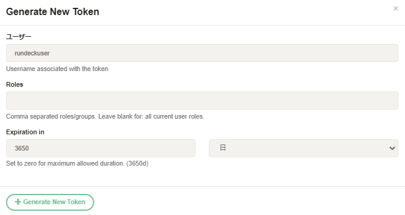
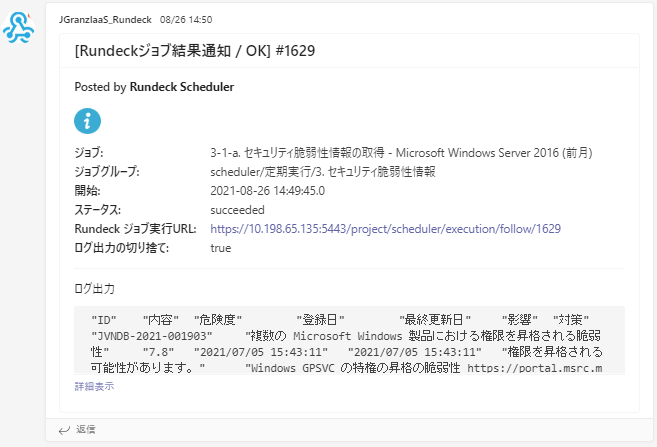

Rundeck Microsoft Teams Notification with Log Plugin
====================================================

## 機能概要

Rundeckのジョブ実行時、実行結果をMicrosoft Teams（以下、Teams）のチャンネルにメッセージ通知する機能を提供する。

* 本ツールは、主として以下の機能を提供する。
  * Teamsのチャンネルにメッセージを通知する機能
  * TeamsへのメッセージにRundeckのジョブ出力を含める機能（オプションにより含めない指定も可能）
  * Teamsへのメッセージをテンプレートファイルとして提供し、コードの修正なしにメッセージのレイアウトなどを変更できる機能（ジョブごとに異なるテンプレートを指定することも可能）

* 本ツールで送信されるメッセージに含まれる内容
  * ジョブ名
  * ジョブグループ名
  * 開始時間
  * Rundeckのジョブ実行URL
  * ジョブのログ出力の切り捨て有無（Teamsのメッセージは、25kbytes以内に制限される。本ツールでは、デフォルトでジョブ出力の14kbytesまでをメッセージに含めて送信する。14kbytesを超えたメッセージについては、切り捨てる。切り捨てを行なった場合は、本項目がtrueにセットされる。）
  * ジョブのログ出力

* Rundeckのジョブ実行時のTeams通知の処理は、以下の順序で処理する。

    1. RundeckのAPIを利用して、ログを取得する
    2. ログのサイズが14kbytes以上の場合は、切り捨てる
    2. メッセージのテンプレートファイルを読み込む
    3. メッセージのテンプレートにジョブの各種ステータスを置換
    4. TeamsのWebhook URLにメッセージを送信

## 前提条件

* 本ツールの実行環境に関する要件
  * OS: RHEL7.4/CentOS7.4以上
  * Rundeck: 3.0以上
  * 通信要件など
    * TeamsのWebhook URLへのHTTPS（443）での接続性が必要
    * Rundeck APIへのHTTPS（443）での接続性が必要
    * 本物件を格納するGitリポジトリに、SSHまたはHTTPSでpull/pushが可能であること（構築時のみ）

## ディレクトリ構成

* 本物件のディレクトリ構成

```directory tree
rundeck-microsoft-teams-notification-with-log-plugin
├── LICENSE: ライセンス
├── doc
│   ├── README.md: 本ドキュメント
│   `── images: ドキュメント用画像
│    
├── src
│   ├── MicrosoftTeamsNotificationWithLog.d
│   │   ├── images
│   │   │   ├── alert-icon.png: ジョブ失敗時にメッセージに出力するアイコン
│   │   │   `── information-icon.png: ジョブ成功時にメッセージに出力するアイコン
│   │   `── templates
│   │       ├── SimpleMessage-en.template: メッセージのテンプレート（ジョブ出力有り。英語）
│   │       ├── SimpleMessage-ja.template: メッセージのテンプレート（ジョブ出力有り。日本語）
│   │       ├── SimpleMessage-nolog-en.template: メッセージのテンプレート（ジョブ出力無し。英語）
│   │       `── SimpleMessage-nolog-ja.template: メッセージのテンプレート（ジョブ出力無し。日本語）
│   `── MicrosoftTeamsNotificationWithLog.groovy: プラグイン本体(Groovyスクリプト)
`── test.groovy: テスト用スクリプト
```

## インストール

本ツールの導入は、Rundeckのプラグインディレクトリに物件をコピーし、Rundeckを再起動することで完了する。
以降は、RundeckのプラグインディレクトリとGitリポジトリのサーバが以下パスとサーバである想定で記載する。各環境に合わせて、適宜読み替えること。

```
Rundeckのプラグインディレクトリ: $RUNDECK_PLUGIN_DIR
Gitリポジトリサーバ: $GIT_SERVER (以下の例では、SSH/4022でアクセス可能であること)
Gitリポジトリ名: /op-scripts/rundeck-microsoft-teams-notification-with-log-plugin.git
```

1. 最新の物件の取得

```bash
$ git clone ssh://git@${GIT_SERVER}:4022/op-scripts/rundeck-microsoft-teams-notification-with-log-plugin.git
```

2. Rundeckのプラグインディレクトリに物件をコピー

```bash
$ cd rundeck-microsoft-teams-notification-with-log-plugin
$ sudo cp -r src/* $RUNDECK_PLUGIN_DIR/
```

3. RundeckのAPI Tokenの有効期間の修正  
本ツールは、Rundeckのログを取得するために、RundeckのAPI Tokenを利用する。
API Tokenには有効期間があり、デフォルトで最長３０日であり、期限を迎えると再作成が必要となる。
そのため、有効期間の最長を変更する。
Rundeckの設定ファイルを修正する必要があるが、各導入環境に合わせて、パスを読み替えること。
以下の例では、最長10年に設定する。

```bash
# vi /srv/docker/rundeck/rundeck/etc/rundeck/rundeck-config.properties
〜以下を追加〜
rundeck.api.tokens.duration.max=10y
```

4. Rundeckの再起動  
Rundeckの実行環境に応じて、起動方法は異なる。
各環境に応じて、再起動すること。以下の例では、docker-composeを利用する場合の例を示す。

```bash
# cd /srv/config/rundeck
# docker-compose down
# docker-compose up -d
```

## メッセージ内容・レイアウトの変更

Teamsに通知するメッセージの内容やレイアウトを変更したい場合は、テンプレートのファイルを修正することで調整が可能となる。
以降は、Rundeckのプラグインディレクトリが以下のパスである想定で記載する。各環境に合わせて、適宜読み替えること。

```
Rundeckのプラグインディレクトリ: $RUNDECK_PLUGIN_DIR
Gitリポジトリサーバ: $GIT_SERVER (以下の例では、SSH/4022でアクセス可能であること)
Gitリポジトリ名: /op-scripts/rundeck-microsoft-teams-notification-with-log-plugin.git
```

1. 最新の物件の取得

```bash
$ git clone ssh://git@${GIT_SERVER}:4022/op-scripts/rundeck-microsoft-teams-notification-with-log-plugin.git
```

2. テンプレートファイルの変更  
標準のテンプレートは、以下の４つを提供する。通知メッセージ中にログを含める場合と含めない場合で、異なるテンプレートファイルを利用する。以降の例では、日本語のログを含めるメッセージのテンプレートファイルの修正を行う。メッセージの書式は、TeamsのIncoming WebhookがサポートするJSON形式（MessageCard）


| 言語   | ログ出力 | ファイル名                        |
| :---: | :-----: | :------------------------------ |
| 日本語 | 有り     | SimpleMessage-ja.template       |
| 日本語 | 無し     | SimpleMessage-nolog-ja.template |
| 英語  | 有り     | SimpleMessage-en.template        |
| 英語  | 無し     | SimpleMessage-nolog-en.template  |

ジョブの通知オプションで指定する[Message template]と[Template language]パラメータにより、テンプレートのファイル名は以下形式で決定される。
| ログ出力 | ファイル名                        |
| :-----: | :------------------------------ |
| 有り     |[Message template]-[Template language].template |
| 無し     |[Message template]-nolog-[Template language].template |

(参考) メッセージを作成して送信する - Teams | Microsoft Doc

https://docs.microsoft.com/ja-jp/microsoftteams/platform/webhooks-and-connectors/how-to/connectors-using?tabs=cURL

```bash
$ cd rundeck-microsoft-teams-notification-with-log-plugin
$ vi src/MicrosoftTeamsNotificationWithLog.d/templates/SimpleMessage-ja.template
～省略～
{
    "@type": "MessageCard",
    "@context": "https://schema.org/extensions",
    "themaColor": "${color}",
    "summary": "***[Rundeckジョブ結果通知 / ${job_status}] #${execution.id}***",
    "title": "[Rundeckジョブ結果通知 / ${job_status}] #${execution.id}",
    "sections": [
        {
            "activityTitle": "Posted by **Rundeck Scheduler**",
            "facts": [
                {
                    "name": "ジョブ:",
                    "value": "${execution.job.name}"
                },
                {
                    "name": "ジョブグループ:",
                    "value": "${execution.job.group}"
                },
                {
                    "name": "開始:",
                    "value": "${execution.dateStarted}"
                },
                {
                    "name": "ステータス:",
                    "value": "${execution.status}"
                },
                {
                    "name": "Rundeck ジョブ実行URL:",
                    "value": "${execution.href}"
                },
                {
                    "name": "ログ出力の切り捨て:",
                    "value": "${log_snipped}"
                }
            ],
            "text": ""
        },
        {
            "startGroup": true,
            "title": "ログ出力",
            "text": "```${job_log}```"
        }
    ]
}
```

3. Gitリポジトリへのコミットとプッシュ  
必要に応じて、変更したテンプレートファイルをコミットし、Gitリポジトリにプッシュする。

```bash
$ git add src/MicrosoftTeamsNotificationWithLog.d/templates/SimpleMessage-ja.template
$ git commit -m "change テンプレートファイルのレイアウト修正など"
$ git push
```

4. Rundeckのプラグインディレクトリに物件をコピー

```bash
$ sudo cp -r src/MicrosoftTeamsNotificationWithLog.d/templates/* $RUNDECK_PLUGIN_DIR/MicrosoftTeamsNotificationWithLog.d/templates/
```

## 利用方法

### RundeckのAPI Token作成

利用に先立って、本ツールがRundeckのログを取得するためAPI Tokenを生成する。

1. RundeckのWEB UIに、通知を行うユーザでログインする。
2. 右上のアカウントアイコンをクリックし、[Profile]を選択する。
3. [User API Tokens]の右に表示される、[+]をクリックする。
4. [Expirated in]の下に表示されている左のインプットボックスに[3650]を入力し、
右のドロップダウンボックスから[日]を選択する。

5. [+Gernerate New Token]をクリックする。
6. 追加されたAPI Tokenの[Show Token]ボタンをクリックし、API Tokenの文字列を以降の設定のために控えておく。

### ジョブの通知設定

ジョブの設定を行うことで、成功時・失敗時・開始時に通知を行うことができる。
以下の例では、成功時と失敗時に通知を行う。

1. 通知を行いたいジョブの実行画面で、右のハンバーガーアイコンをクリックし、[このジョブを編集]を選択する。
2. [Send Notification?]オプションを[はい]に設定する。
3. 成功時の[Micorosoft Teams Notification with log output]にチェックを入れる。
4. [webhook URL]に、TeamsのWebhook URLを入力する。
5. [Rundeck User API Token]に、生成したAPI Tokenを入力する。
6. [Include job output as inline message]に、通知メッセージにログを含める場合はtrue、ログを含めない場合はfalseを設定する。
7. [Message template]に、通知メッセージのテンプレートを指定する。
8. [Template language]に、テンプレートの言語を指定する。日本語の場合はja、英語の場合はenを設定する。
9. 失敗時についても、3〜8と同様に設定する。
10. [保存]をクリックする。
## 実行結果（ログ出力など）

Rundeckのジョブ実行後に、TeamsのIncoming Webhookを設定したチャンネルに、以下のような通知メッセージが送信される。



※原則として、エラーの詳細などはジョブ実行のログに出力する。
